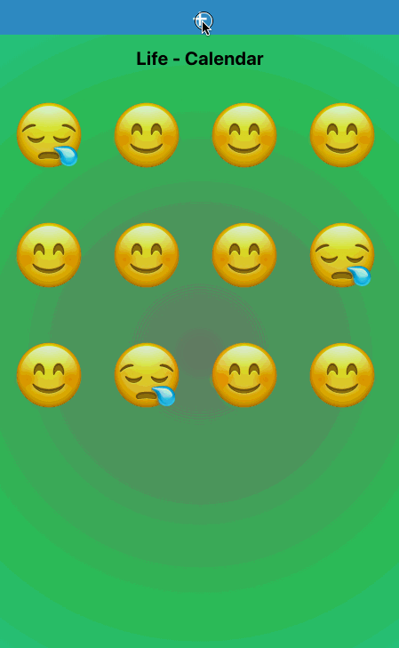

# Life Calendar

Welcome to life-calendar the third project from Adalab`s online training :) You can find the whole specification in [https://books.adalab.es/materiales-front-end-e/formacion-continua/3_prueba_tecnica](https://books.adalab.es/materiales-front-end-e/formacion-continua/3_prueba_tecnica).



## Development

This project uses react so the typical scripts you can find in every react project is valid here:

### Install dependencies
```
npm install
```

### Run the app in development mode

It will start a development serve that allows us to refresh the code with no need of restarting the "server"

```
  npm start
```

### Run the linter
We configured the linter to ensure our code is compliant with the standards of the industry. To ensure the code is good enough, just execute:

```
  npm run lint
```

In case you find some erros, you can give a try to fixLint to fix some common problems:

```
  npm run fixLint
```

### Run the tests

We test both the model and the views with jest, to run the whole test suite you just need to run:
```
  npm test
```

#### Snapshot testiting
As we're using snapshot testing technique to perform our assertions over the react components, we could need to regenerate the snapshots once a component has changed. To do so just run:

```
  npm run recordSnapshots
```

### CI
We use Travis as a CI Server. But in case you want to check everything is ok in your own computer you can run:

```
  npm run ci
```
